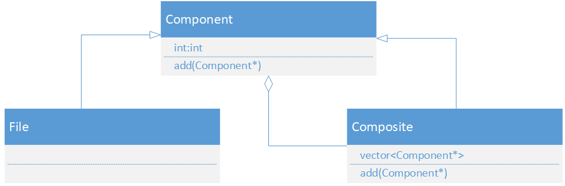
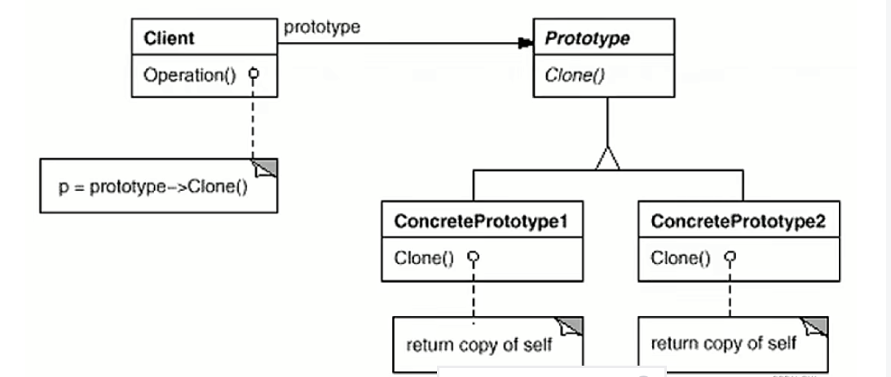
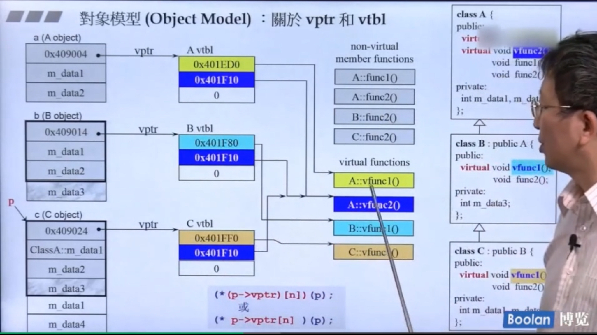

<!-- TOC -->

- [OOP notes 1st](#oop-notes-1st)
  - [1. 头文件.h 和源文件 .cpp](#1-头文件h-和源文件-cpp)
  - [2. without pointer class中layout](#2-without-pointer-class中layout)
    - [inline关键字](#inline关键字)
    - [数据访问](#数据访问)
    - [构造函数](#构造函数)
    - [操作符重载和临时对象](#操作符重载和临时对象)
  - [3. with pointer class中layout](#3-with-pointer-class中layout)
    - [1. 拷贝构造 赋值](#1-拷贝构造-赋值)
    - [2. 栈和堆](#2-栈和堆)
  - [4. class之间的关系](#4-class之间的关系)
    - [1. 复合 has-a](#1-复合-has-a)
    - [2. 委托关系](#2-委托关系)
    - [3. 继承关系 is-a](#3-继承关系-is-a)
    - [4. 某些设计模式 design\_mode示例](#4-某些设计模式-design_mode示例)
- [OOP notes 2nd](#oop-notes-2nd)
  - [1. functions相关](#1-functions相关)
    - [1. conversion function 转换函数](#1-conversion-function-转换函数)
    - [2. non-explict-one-argument ctor 隐式转换函数](#2-non-explict-one-argument-ctor-隐式转换函数)
    - [3. pointer-like class(智能指针) 和 function-like class(仿函数)](#3-pointer-like-class智能指针-和-function-like-class仿函数)
  - [2. templates相关](#2-templates相关)
  - [3. c++2.0](#3-c20)
    - [1. 数量不定的模板参数](#1-数量不定的模板参数)
    - [2. auto 和 for循环](#2-auto-和-for循环)
  - [4. 对象模型](#4-对象模型)
    - [1. 虚函数 虚表指针 虚表](#1-虚函数-虚表指针-虚表)
    - [2. 关于this](#2-关于this)
  - [5. 额外需了解的](#5-额外需了解的)
    - [1. 关于const](#1-关于const)
    - [2. new 和 delete](#2-new-和-delete)

<!-- /TOC -->

# OOP notes 1st
关于面向对象高级编程（上）的笔记  

## 1. 头文件.h 和源文件 .cpp
头文件声明，源文件实现，源文件包含头文件和 标准库的某些文件。包含头文件时：
>#include<a.h> 包含标准库头文件用尖括号<>   
>#include"a.h" 包含自建头文件用双引号" "  

头文件中需要避免被重复包含：
```
// 写在文件最开头
#ifndef _A_
#define _A_

...

#endif
```
上面代码含义为 if \_A_ 没有被 define，就define一下，然后包含；第二次包含时，发现已经define了,就不会进入下面的代码，就不会被重复包含(ps: **A通常为文件名**，且#ifndef要写在文件最开头)。  

## 2. without pointer class中layout
主要讲没有指针的class中的某些常用到的属性，例如构造函数，析构函数，inline关键字等...

### inline关键字
inline是对编译器的建议，通常简单点的函数都可以是inline，编译时进行内联，有点类似于宏。推荐inline关键字放在定义前。
### 数据访问
数据要写成private，尽量使用数据时，以接口的形式返回。
### 构造函数
构造函数尽量使用初始化来初始化初值（理解有两过程：初始化和赋值，尽量在初始化的时候就完成）
```
// 假如类名为complex,有两个member data
complex(double r,double i):re(r),im(i){}
```
构造函数可以重载，例如默认构造，有参构造，拷贝构造，c++中支持函数重载的原因是因为：  
>函数编译会对函数名进行修饰，取决于编译器 

函数重载有时也不能同时存在，例如：
```
// 这两个构造函数不能同时存在，要不然会导致歧义
complex(double r=0,double i=0):re(r),im(i){}
complex():re(0),im(0){}
```

1. 构造函数被放在private  
    就是不能为外界创建对象，只能在堆区创建对象；(单例模式)
    ```
    #include<iostream>
    using namespace std;

    class A{
    public:
        static A& getInstance(){
            static A instance;
            return instance;
        }
    private:
        A(){}
    };

    int main(){
        A& a = A::getInstance();
        return 0;
    }
    ```
2. 常量成员函数  
加const 修饰，不改变数据，只能放在()后，大括号前，如``` double real() const{return re;}```,如果放在跟double一起，就会存在歧义。并且 **常对象调用常函数**，反正根据常识来看，**不能常对象调用非常函数**。
3. friend 关键字  
   友元，可以自由访问private成员。
4. pass by reference  
   1. 拷贝构造函数必须传引用，如果传值，就会无限递归...
   2. 一般操作符重载 += -=都return by reference,因为原本的值会变。
### 操作符重载和临时对象
1. 例如```c2+=c1```，右边c1为传入的参数，作用在左边c2上，所以默认参数有个this，代表c2；  
2. += 可以连续赋值： ```c3+=c2+=c1```从右往左执行，且返回值需要为引用。  
3. +返回的需要是value，不能是reference；举例：  
   ```
    T operator +(const T& a,const T& b){...}
   ```
   因为 int a = b+c,返回的是一个临时对象，所以只能返回值，临时对象脱离作用域就会自动destory。
4. 临时对象是 `typename()`
5. 重载<<:
    ```
    class complex{
    public:
        complex(double r, double i) : real(r), imaginary(i) {}
        double real;
        double imaginary;
    };
    inline  ostream& operator<<( ostream& os, const complex& c)
    {
        return os << "Real: " << c.real << " Imaginary: " << c.imaginary;
        
    }

    int main()
    {
        complex c(1.0, 2.0);
        cout <<c << endl;
        
    }
    ```
    [重载<<代码示例](example.cpp)
    考虑几个点：
    >1.ostream& os前要不要加const(这里为cout)：不可以，加了说明os不能改，往os丢东西其实就是在改os状态  
    >2.连串的输出，所以return by reference
## 3. with pointer class中layout
上面讲了类中没指针的class(以complex为例)，这里讲下带指针的class，以string为典型例子. 但是string标准库较为复杂，选择自己实现：[my_string](my_string.cpp)
### 1. 拷贝构造 赋值
如果含有指针，应该要重写拷贝构造和赋值函数，避免浅拷贝...，具体见[my_string.cpp](my_string.cpp)  
1. ```if(this == &s){return *this;  // 检测是否自我赋值}```:  
    该检测自我赋值必须有，要不然如果两个指针指向同一个对象，会直接delete掉，原本数据也delete掉了。
2. 重载<<输出string,该函数要写成非成员函数：
    >如果写成 成员函数，还需要类来调用，不符合常理，而且cout的位置也会发生变化，之前是```cout<<c```,之后是`c.operator<<(cout)`;如果要连续输出就是：`cout << str1 <<str2<<endl; 和 str2.operator<<(str1.operator<<(cout));`
    ```
    // 适配cout,写成非成员函数
    inline ostream& operator<<(ostream& os, const my_string& s){
        return os << s.get_c_str();
    }
    
    //写成成员函数
    inline ostream& operator<<(ostream& os){
        return os << this->get_c_str();
    }
    ```
### 2. 栈和堆
普通对象：作用域结束就自动析构；    
静态对象：作用域结束不析构，等程序结束，再析构，但是**超出作用域不能再使用了**；  
全局对象：程序结束再析构；
[对象代码示例](stack_heap.cpp)
```
int a = 10;
int main(){
    {   
        static int b = 20;
        int c = 30;
    }
    cout<<a<<endl;
    cout<<b<<endl; // 无法使用
    cout<<c<<endl; // 无法使用
}
```
1. new 和 delete
new可以分解为以下3步,`complex* pc = new complex(1,2)`：
```
void* mem = operator new(sizeof(complex)); // 分配内存
pc = static_cast<int*>(mem); // 类型转换
pc->complex::complex(1,2);   // 构造函数
```
delete转换为两个动作：先调用析构函数，再释放内存。  
delete[] 调用多次析构函数，delete 只调用1次析构函数，所以 new[]一般就配合delete[]。
## 4. class之间的关系
见[class-class](class-class.cpp)
### 1. 复合 has-a
例如 queue底层实现是用deque，这就是复合。倘若b has a，那么构造是由内而外，先调用a构造函数，再调用b构造函数。析构相反，由外而内。是编译器帮你实现的。
```
class A{
public:
    A(){
        cout<<"A constructor"<<endl;
    }
    ~A(){
        cout<<"A destructor"<<endl;
    }
};
class B{
public:
    B(){
        cout<<"B constructor"<<endl;
    }
    ~B(){
        cout<<"B destructor"<<endl;
    }
    A a;
};
int main(){
    /*
    A constructor
    B constructor
    B destructor
    A destructor
    /*
    B b;  
    return 0;
}
``` 
### 2. 委托关系
跟复合有点像，但是不是A有一个object B，是A里面有个指向B的指针：
```
class B{

};
class A{
public:
    B* b; // pimpl
};
```
**这个有点像STL中的实现**，就是A里面的函数实现都丢给B* b，B中具体实现，所以b叫做**pointer implement**。具体可以去看源码。
### 3. 继承关系 is-a  
同样构造由内到外，析构由外到内。子类析构会自动调用父类析构，先析构自己后析构父类。  
1. 继承 with 虚函数  
   虚函数前面写virtual，函数不能讲继承，继承的是函数的调用权。
   >纯虚函数，子类必须重写  
   >虚函数，子类可以选择重写，也可以选择不重写  
   >非虚函数，子类不能重写
2. 有继承有复合，ctor和dtor怎么考虑？  
    1. b继承于a，b还有c  
    ```
    A constructor
    C constructor
    B constructor
    B destructor
    C destructor
    A destructor
    ```
    b是最后，毋庸置疑，但是a和c的顺序需要看看，貌似还是子类优先，先构造a。
    2. b继承于a，a有c  
    ```
    C constructor
    A constructor
    B constructor
    B destructor
    A destructor
    C destructor
    ```
    这个毋庸置疑，构造由内而外，析构由外而内。
### 4. 某些设计模式 [design_mode示例](design_mode.cpp)
基于三种类之间的关系，进行面向对象设计，也被称为设计模式。  
1. composite模式  
    以文件系统为例，有目录有文件，目录里面可以放文件，目录和其他目录组合起来又可以放在新的目录里；这需要用到composite模式。  
  
file代表文件，component代表目录基类，下面composite为目录。
所以目录要既能够添加目录也能够添加文件，所以让composite中的指针为component，file和composite都继承component。
2. prototype模式(原型模式)  
    >通过克隆自己来创建对象：原型就是具体类中有一个原型，但他不是供使用，而是供clone的；  
    Client：客户端，代表使用原型模式的代码部分。客户端需要创建对象，但是它通过请求现有对象的克隆来创建新对象，而不是直接创建。
    

# OOP notes 2nd
关于面向对象高级编程（下）的笔记，主要谈对象模型、模板、泛型，更深层次了解this指针，虚指针、虚表等。主要讲：
> variadic template(since c++11)  
> auto (since c++11)  
> range-base for loop (since c++11)  

## 1. functions相关
### 1. conversion function 转换函数
[代码示例example1](functions.cpp)，举例说明：
```
double a =3.1;
int b = (int)a; // 这就是强制转换，double转为int
```
并且一般在赋值操作中都会默认转换，需要注意两点：
>1. 不可以对转换函数写 returnType  
>2. 编译器有时会自动做转换,但是如果转换路径比较多，就会有歧义，导致报错
```
class F{
public:
    F(int _a,int _b):a(_a),b(_b){}
    // 并且不可以对转换函数指定 returnType
    operator double(){
        return (double)(a/b);
    }
private:
    int a;
    int b;
};
int main(){
    F f(3,2);
    double a = 4+f;   // 编译器会自动考虑使用 double(f)
    cout<<a<<endl;
}
```
### 2. non-explict-one-argument ctor 隐式转换函数
[代码示例example2](functions.cpp)，explicit意为清楚，举例：
```
class A{
public:
    A(int num):num(num){}
private:
    int num;
}

// 可以将3自动转为class A
int main(){
    A a = 3
}
```
**explicit也是关键字，只用于构造函数(禁止隐式构造)**
### 3. pointer-like class(智能指针) 和 function-like class(仿函数)
这里主要引出智能指针的概念和仿函数的概念即可。这里随便写个指针；如[pointer_like_class](pointer_like_class.cpp)。值得注意的是：
>重载->的时候，按道理直接返回ptr，为何还会等同于 ptr->use():因为重载->的东西还会自动添加->进行操作。

仿函数就是类重载（）,实现跟函数一样的功能。且通常会去继承 unary_function 或者binary_function。两者源码如下：  
```
// 一元
template<typename _Arg, typename _Result>
struct unary_function
{
    /// @c argument_type is the type of the argument
    typedef _Arg 	argument_type;   

    /// @c result_type is the return type
    typedef _Result 	result_type;  
};
```
```
// 二元
template<typename _Arg1, typename _Arg2, typename _Result>
struct binary_function
{
    /// @c first_argument_type is the type of the first argument
    typedef _Arg1 	first_argument_type; 

    /// @c second_argument_type is the type of the second argument
    typedef _Arg2 	second_argument_type;

    /// @c result_type is the return type
    typedef _Result 	result_type;
};
```
注意，如果直接去sizeof() 上述的两个类，得到大小会是 1 (即使没有成员)
>空类的大小为1，为了区分实例化后的对象，这里的空类只是不含数据(有可能会有函数)。源码见[empty_class](empty_class.cpp)。
## 2. templates相关
template有 class template 、 function template、member template。member template指的是class的成员使用了模板，例如 class A有个pair函数，pair的输入就可以是任意。这就是个member template。  
模板又存在模板特化和偏特化。这个在STL中day1讲了，[template](../STL/day1/template.cpp)。  
>1. typename只有在写模板参数那里共通,其他地方不共通。`template<class T> 等同于 template<typename T>`。   
> 2. 模板模板参数是一种特殊形式，如
>`template<typename T,template<typename T> class Container>`,意思就是以T为Container的元素参数类型。但是由于Container实例化不止一个参数，还有默认的allocator，所以需要把allocator也作为参数加进去。如果只需要一个参数，例如Smart_ptr，那就可以直接构建。
## 3. c++2.0
c++2.0 主要讲的就是 since C++11。[cpp2.0](c++2.0.cpp)示例。可以通过`cout<<__cplusplus`来看编译器版本。`__cplusplus`是个宏，定义好的。
### 1. 数量不定的模板参数
语法`template<typename T,typename... Args>`,意为要接受两组参数，第一组是T，第二组数量未定。  
以函数模板为例, ... 的位置如下所示：
```
void print(){};
void print(const T& firstArg,const Args&... args ){
    cout<<firstArg<<endl;
    print(args...) // 注意这个... 放args后面
};
```
并且需要函数重载，因为最后传入的参数是0个，所以需要重载一个无传参数的。
>sizeof...(args)可以得到 **这一包** 的参数个数。

### 2. auto 和 for循环
auto进行类型自动推导，for循环在c++11中可以有新写法：
>`for auto ele :vec:` 和 `for auto& ele :vec:`，前者不能更改容器元素，后者可以。  

关于引用，引用底层实现也是指针（按道理大小是8字节），但是为了营造假象，假如a是b的引用，那么a和b的大小相同，a和b的地址也相同。
> 1. reference用的最多的就是参数传递，不常用声明变量。
> 2. 在参数传递时：```void fun1(const int a){}; 和 void fun1(const int& a){}```,这两个不能同时存在，要不然会存在歧义，假如fun1(10)，编译器不知道在调用哪个函数。


## 4. 对象模型
### 1. 虚函数 虚表指针 虚表
以侯捷老师讲义上图片为例：
关于虚表指针和虚表：虚表指针在内存里最前面。
> 1. 讲义最下面是调用顺序转为C的写法。解释：首先 p 通过 -> 操作符访问其 vptr 成员，这是一个指针数组。然后，通过 [] 操作符使用索引 n 访问这个指针数组的第 n 个元素，得到一个新的指针。最后，* 操作符对这个新指针进行解引用，得到该指针指向的值。
> 2. 两者等效，因为*的优先级最低。
> 3. 后面的（p）是什么意思？ 前面的*取后是一个函数，p也是this，而函数的调用默认第一个参数就是this，所以是 `*p->vptr[n](p)`。

### 2. 关于this
this实际上是指向实例化对象的指针，或者说实例化对象的地址。所有的非静态成员函数都有this参数。
动态绑定的三个条件：
>1. 指针调用 
>2. 可以向上转型（指向对象为子类对象）
>3. 调用虚函数

## 5. 额外需了解的
### 1. 关于const
const属于函数签名的一部分：当成员函数的const版本和 non-const版本**都存在**时，const object只调用const版本，non-const object只调用non-const版本。
### 2. new 和 delete
new 和 delete 的分解动作前面讲了，主要就是调用 operator new 和 operator delete函数。
>1. 如果需要定制化操作，可以选择对operator new 和 operator delete 进行重载。  
>2. 若无成员 operator new/operator delete 函数，直接调用全局的。
>3. 如果想强制使用全局operator new/operator delete，可以`::operator new` 来强制使用，前面添加::。
>4. 通常如果使用array new，分配的内存会多用个 counter 来存要调用多少次ctor/dtor(构造函数/析构函数)

new有多个版本，第一参数必须是size_t(因为要传入开辟空间大小)，其余的参数是以placement arguements为初值，是placement new。例如 ` Foo* f = new(p)Foo(300);`前面p
是传入的指针/或者说空间，后面的300是Foo初始化的值。  


   


