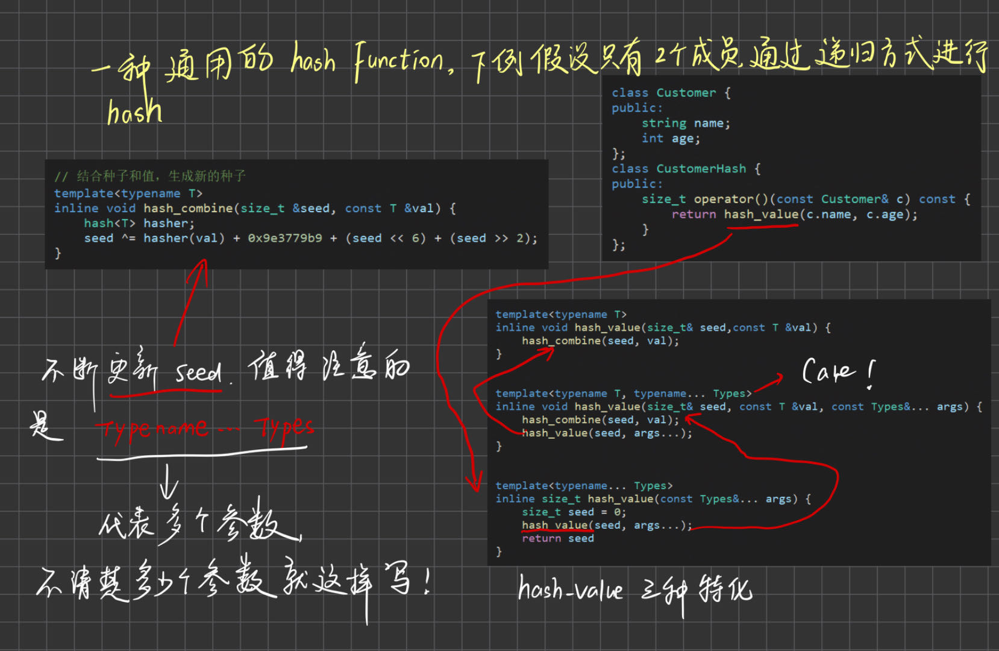

<!-- TOC -->

- [一个万能的hash function](#一个万能的hash-function)
- [tuple](#tuple)
- [type\_traits](#type_traits)
  - [is\_void](#is_void)
  - [is\_integral](#is_integral)
  - [is\_class is\_union is\_enum is\_pod](#is_class-is_union-is_enum-is_pod)
- [cout 研究](#cout-研究)
- [moveable](#moveable)

<!-- /TOC -->
# 一个万能的hash function
一种思路：将obj的各个参数分别去hash，分别将hash_code加起来,但是这种不太适合，有一种通过递归的思路如下：
  
值得注意的是 ```typename... types```,存在多个参数。 
或者可以以struct hash偏特化形式实现hash function。  

# tuple
tuple是个元组，一堆东西的组合，可以组合不同类型的数据。  
用make_tuple生成tuple，get取值，不可以用[]取值
```
auto it = make_tuple(1, 2, "nico");
cout<<typeid(it).name()<<endl;
cout<<get<0>(it)<<endl;
```
这种多参数的实现跟上面hash function实现有点像，将n个参数分为 1和 n-1,然后n-1个参数分为n-2和 1，依次下去...看其源码太复杂了，看不懂一点，太多类了，但是大概可知道，是一个个类继承；
```
struct _Tuple_impl<_Idx, _Head, _Tail...>
: public _Tuple_impl<_Idx + 1, _Tail...>

class tuple : public _Tuple_impl<0, _Elements...>
{
    typedef _Tuple_impl<0, _Elements...> _Inherited;
    ....
}
// 调用基类构造函数
constexpr tuple()
: _Inherited() { }
```
说明_Inherited是基类，不断调用基类的构造函数，不断构造...

# type_traits
理解就是对于每一种type进行traits，问其：是否需要重写构造、析构等函数（比如指针需要）。  
现在的版本有很多type_traits,如 is_class is_integral 等,问其特性。还有一些例如：```has_virtual_destructor```,问有没有虚析构函数...  
拿几个例子看看type_traits实现

## is_void
```
/// is_void
template<typename _Tp>
struct is_void
: public integral_constant<bool, (__is_void_helper<typename
                    remove_cv<_Tp>::type>::value)>
{ };
```
简单起见，有些函数我就不贴了，remove_cv代表将const 和 volatile这种属性给移除掉，因为type没这种属性，const int的type依旧是int；is_void_helper就会help，如果是void就返回true，其他的返回false。

## is_integral
```/// is_integral
template<typename _Tp>
struct is_integral
: public __is_integral_helper<typename remove_cv<_Tp>::type>::type
{ };
```
同样先 remove_cv，然后丢给helper，看特化版本：
```
  template<typename>
    struct __is_integral_helper
    : public false_type { };

  template<>
    struct __is_integral_helper<bool>
    : public true_type { };

  template<>
    struct __is_integral_helper<char>
    : public true_type { };

  template<>
    struct __is_integral_helper<signed char>
    : public true_type { };

  template<>
    struct __is_integral_helper<unsigned char>
    : public true_type { };
```
默认false,其余是整型的进行特化，为true。

## is_class is_union is_enum is_pod
pod可以简单理解为只有data，没有function。包括一些基本的数据类型，例如int就是pod
```
  /// is_enum
  template<typename _Tp>
    struct is_enum
    : public integral_constant<bool, __is_enum(_Tp)>
    { };

  /// is_union
  template<typename _Tp>
    struct is_union
    : public integral_constant<bool, __is_union(_Tp)>
    { };

  /// is_class
  template<typename _Tp>
    struct is_class
    : public integral_constant<bool, __is_class(_Tp)>
    { };

```
主要就是_is_class等函数，这种没有以源代码形式存在，估计是编译器在处理。

# cout 研究
首先cout其实是一个对象，```extern ostream cout;``` 类ostream实例出来的 object。看ostream实现如下：  `typedef basic_ostream<char> 		ostream;`,继续看 basic_ostream中重载了很多<<
```
__ostream_type& operator<<(long __n)
{ return _M_insert(__n); }

__ostream_type& operator<<(unsigned long __n)
{ return _M_insert(__n); }

__ostream_type& operator<<(bool __n)
{ return _M_insert(__n); }
```
因此cout可以输出很多东西...

# moveable
就是move函数，右值引用...


