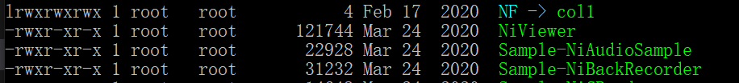
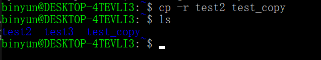

<!-- TOC -->

- [linux 命令行](#linux-命令行)
  - [1. linux结构](#1-linux结构)
  - [2. 文件基本属性](#2-文件基本属性)
  - [3. 文件目录管理](#3-文件目录管理)
    - [1. ls(列出目录)](#1-ls列出目录)
    - [2. cd(切换目录)](#2-cd切换目录)
    - [3. pwd(显示当前所在目录)](#3-pwd显示当前所在目录)
    - [4. mkdir 和 rmdir](#4-mkdir-和-rmdir)
      - [4.1 rm](#41-rm)
    - [5. cp(复制文件或目录)](#5-cp复制文件或目录)
    - [6. mv (移动文件或目录)](#6-mv-移动文件或目录)
  - [4. 文件查看](#4-文件查看)
    - [1.显示内容](#1显示内容)
      - [1. cat](#1-cat)
      - [2. head 和 tail](#2-head-和-tail)
      - [3. nl](#3-nl)
  - [5. 文件编写](#5-文件编写)
  - [6. 网络管理](#6-网络管理)
  - [7. 备份压缩](#7-备份压缩)
  - [8. 搜索](#8-搜索)

<!-- /TOC -->
# linux 命令行
linux命令行大概花了1-2h掌握常用的command即可，笔者参考了[LinkedInLearning的Linux命令行教程](https://github.com/LinkedInLearning/learning-linux-command-line-3005201)。该目录下 [command.md](other_notes.md)为他人的notes，我将以此为基础进行一些扩展与学习。这里也提供一个用来查询linux命令的网站[Linux查询网站](https://jaywcjlove.gitee.io/linux-command/#!kw=ls)。 

## 1. linux结构
linux由 linux内核、shell、文件系统和第三方应用软件组成，基本只研究下shell即可。常用shell版本为bash。通常命令基本形式为 `cmd [options] [arguements]`,并且根据选项的字母个数选择前面用- 还是--。单字符就用-，多字符就用--（大部分符合这样的规律）。  
大部分时候我们要查询某命令参数有哪些，以ls为例，可以通过以下命令来查询：
>1. man ls （man意为manual：手册）
>2. ls --help  

并且在学习linux命令之前，先熟悉一下绝对路径、相对路径等：
>1. 绝对路径由根目录 / 写起。
>2. 相对路径不由 / 写起，`·` 代表当前目录,`..`代表上级目录。

## 2. 文件基本属性
通常用 `ls -l`列举 文件的所有属性，l意味着long。如下所示：
  
第一个字母有可能是 d l -(分别代表目录、链接文档、文件，链接文档类似于windows下的快捷方式)，之后字母是按照rwx（代表读写执行，用数字表示为 4 2 1）的顺序展开，重复3次（代表文件所有者、文件所有者同组、其他用户）。如果没有对应权限，会用 - 代替。  
常用指令 `chmod -R 777 文件或目录`, -R代表递归改变，7为属性的值的相加，也可以 `chmod u=rwx,g=rw,o=x`文件名来设定文件权限。
> 个人理解：为什么这个不用 -r 代表递归，是因为 在chmod中改变权限中 r代表 read，用 -R是为了避免歧义。

## 3. 文件目录管理
### 1. ls(列出目录)
ls为列出目录，包含以下：
1. ls (普通列出目录)
2. ls -a (列出所有目录，包含隐藏文件) （a means all）
3. ls -l (包括文件的属性与权限等)
4. ls -d (只列出目录)
5. ls -al (上述2和3的结合)，也可以 `ls -a -l`

### 2. cd(切换目录) 

cd 绝对路径或相对路径

### 3. pwd(显示当前所在目录)

前面讲文件属性的时候提及链接文档，pwd显示的是当前目录，`pwd -P` 显示的就是链接文档实际的工作目录，而非链接档本身的目录名  
> P代表 physical，物理的，就是实际工作目录

### 4. mkdir 和 rmdir
mkdir：创建目录
>1. -m 配置文件权限  （m代表 mode：模式）如 `chmod -m 777 test2`
>2. -p 帮助创建上一级目录(递归创建) （p 代表 "parents"，意味着 "父目录"。）  

rmdir:移除空目录
>1. -p,迭代删除空目录，如果目录层级是这样 test1/test1 test2 test3，`rmdir -p test1/test1` 之后就只剩 test2 test3 两个空目录了。如果直接 `rmdir test1` 会报错，因为test1不是空目录。
  

#### 4.1 rm
上述的 rmdir是用来移除空目录，rm是更强大的，可以用来删除非空目录，但是rm 通常是不能用来删除目录的，是用来删除文件。
>1. -f (代表force),强制
>2. -i (means interactive),交互性的
    
>3. -r 递归性的

### 5. cp(复制文件或目录)
语法： `cp source destination`,复制的过程中也可以进行重命名操作。例如:
  
但是复制 directory的时候 需要添加 -r，代表递归操作。

### 6. mv (移动文件或目录)
与上面 cp不同，mv是move。
> 参数有 -f -i ，意思跟上面的类似

  
mv还可以用来改名，如上。也用来移动目录，如下。
  

## 4. 文件查看
上面主要讲目录，这里讲文件。
### 1.显示内容
#### 1. cat
cat 意为 concatenate，连接串联。可接-b -n，前者不打印空白行行号，后者打印空白行行号。
#### 2. head 和 tail
`head -n 3 binyun.txt` 显示前三行，不显示行号。tail同理。
#### 3. nl
nl means number line 编号行，会直接显示行号。

## 5. 文件编写
在命令行环境下通常使用vim编辑器编写，简单学习一下即可。
>1. i 进入编辑模式（到当前光标），o到当前光标的下一行，a到当前光标下一个字符（append）（都常用）  
>2. 方向键控制光标 `数字键+方向键` 表示一下移动多少。  
>3. 一般模式下用 /word 和 ？word 去搜索word，前者从光标以下搜索，后者从光标以上。 
>4. 复制剪切等： 
>    1. dd意味着剪切，yy意味着复制。ndd意味着剪切光标向下的n行，nyy同理。  
>    2. p/P意味着复制，p代表复制在光标下一行，P是上一行
>    3. x/X意味删除，x为向后，X为向前，同样前面可加数字  
>    4. 复制特定文本：按v进入可视模式，然后光标移动选择内容，按y复制，之后按p粘贴即可。
>5. :w 意味储存 :q 意味离开，所以通常保存再离开就是 :wq,另外如果需要强制，在后面添加！（vi中！means 强制）  

1. touch 生成一个空文件。
2. wc 进行统计（words count）
3. echo 将内容重定向到指定的文件，有则打开，无则创建
4. 管道命令 |： 将前面的结果给后面的命令
5. 重定向 >是覆盖模式，>>是追加模式。例 echo "beautiful_xq" > binyun.txt

## 6. 网络管理
>netstat -a 列出所有的端口和连接  
>netstat -at 列出所有的tcp连接  
>netstat -au 列出所有的udp连接  
> ps 所有端口状态

## 7. 备份压缩
解压命令：
1. tar -xzvf filename.tar.gz
2. gzip -d filename.gz 

压缩命令：
1. tar -czvf  filename   c是 create z是zip v理解为 verbose f为file
2. gzip filename

## 8. 搜索
1. whereis file 通常用来寻找跟file相关的文件
2. which 一般只找可执行文件
  
3. 文件系统递归寻找文件时，用 find:find [path] [options] [expression]
   1. 例如`find . -type f -name "*.txt"` 当前目录下按照文件类型找 .txt结尾的文件
4. 文件中寻找内容时用grep，例如 grep "111" binyun.txt

